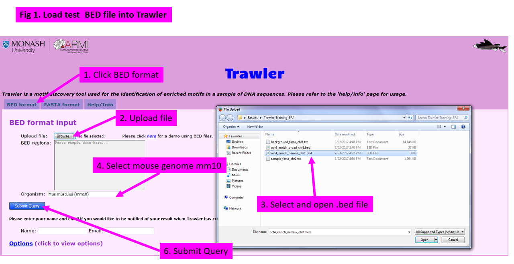
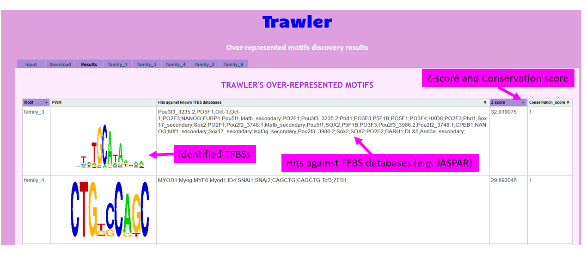
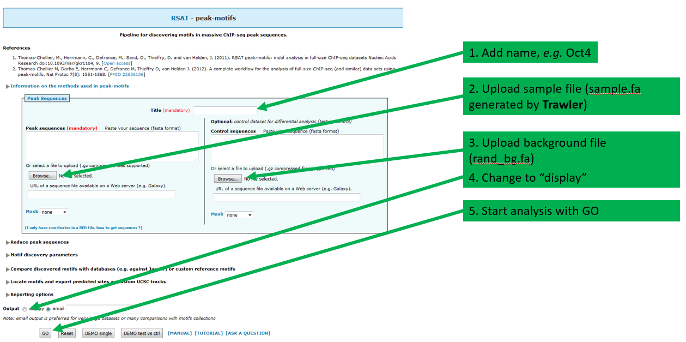
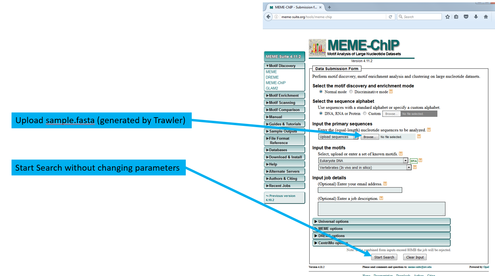

Key Learning Outcomes
---------------------

After completing this practical the trainee should be able to:

-   Perform ChIP-Seq analysis, e.g. the detection of immuno-enriched
    areas using the chosen R package: ChIP-seq processing pipeline (SPP)

-   Visualize the peak regions through a genome browser, e.g. IGV or
    Ensembl, and identify the real peak regions

-   Perform functional annotation using biomaRt R package and detect
    potential binding sites (motif) in the predicted binding regions
    using motif discovery tool, e.g. Trawler or MEME.

Resources You’ll be Using
-------------------------

### Tools Used

SPP:   
http://compbio.med.harvard.edu/Supplements/ChIP-seq/

IGV:  
http://software.broadinstitute.org/software/igv/

Ensembl:  
http://www.ensembl.org

Trawler:  
https://trawler.erc.monash.edu.au/index.html

RSAT peak-motifs
http://floresta.eead.csic.es/rsat/peak-motifs~f~orm.cgi

MEME-ChIP:  
http://meme-suite.org/tools/meme-chip

TOMTOM:  
http://meme.ebi.edu/meme/cgi-bin/tomtom.cgi

DAVID:  
http://david.abcc.ncifcrf.gov

GOstat:  
http://gostat.wehi.edu.au

### Sources of Data

http://www.ebi.ac.uk/arrayexpress/experiments/E-GEOD-11431

Introduction
------------

The goal of this hands-on session is to perform some basic tasks in the
analysis of ChIP-seq data. In fact, you already performed the first
step, alignment of the reads to the genome, in the previous session. We
start from the aligned reads and we will find immuno-enriched areas
using SPP. We will visualize the identified regions in a genome browser
and perform functional annotation and motif analysis on the predicted
binding regions.

Prepare the Environment
-----------------------

The material for this practical can be found in the `ChIP-seq` directory
on your desktop. Please make sure that this directory also contains the
SAM/BAM files you produced during the alignment practical.

If you didn’t have time to align the control file called `gfp.fastq`
during the alignment practical, please do it now. Follow the same steps,
from the bowtie alignment step, as for the `Oct4.fastq` file.

In ChIP-seq analysis (unlike in other applications such as RNA-seq) it
can be useful to exclude all reads that map to more than one location in
the genome. When using Bowtie, this can be done using the `-m 1` option,
which tells it to report only unique matches (See `bowtie –help` for
more details).

Open the Terminal and go to the `ChIP-seq` directory:

    cd /home/trainee/ChIP-seq
    ls
    R

Finding enriched areas using SPP
--------------------------------

Terminology used in the tutorial: `fragment:` overlapping fragments
obtaining in the IP (immuno precipitation) experiments. `tag:` sequenced
part of the fragment which could be from one end (in case of single end
sequencing ) or both ends in the paired end data. `alignment:` a process
to determine the position of the tags, which typically should be around
the binding site. `peaks:` spatial distribution of the tags densities
around the binding sites on the genome. You would see two separate peaks
of tags on the positive and negative strand around the binding site. The
distance between the two peaks should reflect the size of the protected
region.

SPP is a Chip-seq processing pipeline implemented using R.

The main functions of SPP include locating quality tag alignment by
screening overall DNA-binding signals, removing or restricting certain
positions with extremely high number of tags, estimating significant
enrichment regions through genome-wide profiling, providing appropriate
outputs for visualization, and determining statistically significant
binding positions with saturation criteria assessment. Moreover, the
processing of ChIP-seq data can require considerable amount of CPU time,
it is often necessary to make use of parallel processing. SPP supports
parallel processing if the cluster option is configured. Since our
example data is relatively small, we will use single CPU and omit the
cluster parameters for simplicity. The following steps will work you
through the SPP pipeline.

In your R terminal, load spp and biomaRt packages and make sure to set
your working directory correctly:

    library(spp);
    library(biomaRt);
    setwd('/home/trainee/ChIP-seq');

**1. Loading tag data, selecting choosing alignment quality, removing
anomalies**\
The first stage in SPP are 1) load input data; 2) choose alignment
quality and 3) remove anomalies. SPP can read output from the following
aligners and file formats: ELAND, MAQ, bowtie, Arachne, tagAlign format
and BAM format (Note: because BAM standard doesn’t specify a flag for a
uniquely-mapped read, the aligner has to generate a BAM file that would
contain only unique reads.)

### STEP1 Loading data and quality filter the informative tags

First load Oct4 and gfp bam files. Here GFP are the control or input
samples, these are usually mock IP DNA where you do not expect to see
any binding peaks.

    oct4.data<-read.bam.tags("Oct4.sorted.bam");
    gfp.data<-read.bam.tags("gfp.sorted.bam");

The statistical significance of tags clustering observed for a putative
protein binding site depends on the expected background. Therefore, use
of a input or control DNA is highly recommended in the experiment
design. This provides an experimental assessment of the background tag
distribution.

The next step uses cross-correlation profile to calculate binding peak
separation distance, and assess whether inclusion of tags with
non-perfect alignment quality improves the cross-correlation peak. This
is done by shifting the strands relative to each other by increasing
distance within a given range. cross-correlation of the positive and
negative strand tag densities is plotted. The cross-correlation plot
should show the predominant size of the protected region.

    binding.characteristics <- get.binding.characteristics(oct4.data,srange=c(50,500),bin=5);

The binding.characteristics provides the estimate of the binding peak
separation distance, cross-correlation profile itself and tag quality
bin acceptance information. The srange parameter defines the possible
range for the size of the protected region. It is supposed to be higher
than tag length. However, the upper boundary (500) cannot be too high,
which will increase the running time. The bin parameter tags within the
specified number of base pairs to speed up calculation. The increase of
bin size will decrease the accuracy of the determined parameters.

Then, print out binding peak separation distance and we can plot
cross-correlation profile:

    print(paste("binding peak separation distance=",binding.characteristics$peak$x));
    pdf(file="oct4.crosscorrelation.pdf",width=5,height=5);
    par(mar = c(3.5,3.5,1.0,0.5), mgp = c(2,0.65,0), cex = 0.8);
    plot(binding.characteristics$cross.correlation,type='l',xlab="strand shift",ylab="cross-correlation");
    abline(v=binding.characteristics$peak$x,lty=2,col=2);
    dev.off();

A set of tags informative about the binding positions should increase
cross correlation magnitude whereas a randonmly mapped set of tags
should decrease it. The following calls will select tags with acceptable
alignment quality based on the binding characteristics:

    chip.data <- select.informative.tags(oct4.data,binding.characteristics);
    gfpcontrol.data <- select.informative.tags(gfp.data,binding.characteristics);

The last step below will scan along the chromosomes calculating local
density of region (can be specified using window.size parameter, default
is 200bp), removing or restricting singular positions with extremely
high tag count relative to the neighborhood:

    chip.data <- remove.local.tag.anomalies(chip.data);
    gfpcontrol.data <- remove.local.tag.anomalies(gfpcontrol.data);

### STEP2 Calculating genome-wide tag density and tag enrichment/depletion profiles

The following commands will calculate smoothed tag density and output it
into a WIG file that can be read with genome browsers, such as IGV
(Note: the tags are shifted by half of the peak separation distance):

    tag.shift <- round(binding.characteristics$peak$x/2)
    smoothed.density <- get.smoothed.tag.density
    (chip.data,control.tags=gfpcontrol.data,bandwidth=200,step=100,tag.shift=tag.shift);
    writewig(smoothed.density,"oct4.density.wig","Smoothed, background-subtracted tag density");
    rm(smoothed.density);

To provide a rough estimate of the enrichment profile (i.e. ChIP signal
over input), we can use the get.smoothed.enrichment.mle() method:

    smoothed.enrichment.estimate <- get.smoothed.enrichment.mle
    (chip.data,gfpcontrol.data,bandwidth=200,step=100,tag.shift=tag.shift);
    writewig(smoothed.enrichment.estimate,"oct4.enrichment.wig","Smoothed maximum likelihood log2 enrichment estimate");

Next, we will scan ChIP and signal tag density to estimate lower bounds
of tag enrichment (and upper bound of tag depletion if it is
significant) along the genome. The resulting profile gives conservative
statistical estimates of log2 fold-enrichment ratios along the genome.
The example below uses a window of 500bp (and background windows of 1,
5, 25 and 50 times that size) and a confidence interval corresponding to
1%.

    enrichment.estimates <- get.conservative.fold.enrichment.profile(chip.data,gfpcontrol.data,fws=500,step=100,alpha=0.01);
    writewig(enrichment.estimates,"oct4.Enrichment.estimates.wig","Conservative fold-enrichment/depletion estimates shown on log2 scale");
    rm(enrichment.estimates);

Also, broad regions of enrichment for a specified scale can be quickly
identified and output in broadPeak format using the following commands:

    broad.clusters <- get.broad.enrichment.clusters(chip.data,gfpcontrol.data,window.size=1e3,z.thr=3,tag.shift=round(binding.characteristics$peak$x/2));
    write.broadpeak.info(broad.clusters,"oct4.broadPeak");

write out in bed format

    write.table(cbind(rep("1", length(broad.clusters$chr1$s)), broad.clusters$chr1$s, broad.clusters$chr1$e), file = paste0("oct4","_enrich_broad_chr1.bed"),quote = FALSE, row.names = FALSE, col.names = FALSE, sep = "\t");  

The tasks below will use window tag density (WTD) method to call binding
positions, using FDR of 1% and a window size estimated by the
binding.characteristics.

We set the binding detection parameters: FDR (1%) (Note: we can use an
E-value to the method calls below instead of the fdr), the
binding.characteristics contains the optimized half-size for binding
detection window:

    fdr <- 1e-2;
    detection.window.halfsize <- binding.characteristics$whs;

Identify binding positions using WTD method and write narrow peaks in
BED format:

    bp <- find.binding.positions(signal.data=chip.data,control.data=gfpcontrol.data,fdr=fdr,whs=detection.window.halfsize);
    print(paste("detected",sum(unlist(lapply(bp$npl,function(d) length(d$x)))),"peaks"));
    bp.short <- add.broad.peak.regions(chip.data,gfpcontrol.data,bp,window.size=500,z.thr=3); //set the window size to 500.
    write.table(na.omit(data.frame(cbind(rep("1", length(bp.short$npl$chr1$rs)), bp.short$npl$chr1$rs, bp.short$npl$chr1$re))), file = paste0("oct4","_enrich_narrow_chr1.bed"),quote = FALSE, row.names = FALSE, col.names = FALSE, sep = "\t");  

### STEP3 Comparing Binding Sites to Annotations Using the biomaRt package

In order to biologically interpret the results of ChIP-seq experiments,
it is usually recommended to look at the genes and other annotated
elements that are located in proximity to the identified enriched
regions. This can be easily done using the R biomaRt package, which
serves as an interface to perform comprehensive data analysis from gene
annotation to data mining through wealth number of biological databases
integrated by the BioMart software suite (http://www.biomart.org). It
provides fast access to large amount of data without touching the
underlying database or using complex database queries. These major
databases including Ensembl, COSMIC, HGNC, Gramene, Wormbase and dbSNP
mapped to Emsembl.

you should make sure that ensembl has the same version of reference as
you used in bowtie aligner.

We will download the ENSEMBLE mouse genome annotations and generate a
list of ENSEMBLE gene information on chromosome 1 including start
position, end position, strand and description

    ensembl = useMart(host="asia.ensembl.org", "ENSEMBL_MART_ENSEMBL", dataset = "mmusculus_gene_ensembl");
    genes.chr1 = getBM(attributes = c("chromosome_name", "start_position", "end_position", "strand", "description"), filters = "chromosome_name", values= "1", mart = ensembl);

Next, we’re going to take our binding sites from the bp list and use it
to determine the set of genes that contain significantly enriched Pol II
within 2kb of their TSS.

In order to compare PolII sites to TSS sites, we need to write an
overlap function where bs represents a binding site position, ts is the
annotated TSS and l is the allowed distance of the binding site from the
TSS.

    overlap = function(bs, ts, l)
    {
        if ((bs > ts - l) && (bs < ts + l)) {
            TRUE;
        } else {
            FALSE;
        }
    }

Now we’ll write a function that takes a vector of binding site values,
start positions, end positions and strands of the genes on chromosome X
as well as our distance cutoff. l and outputs a logical vector of the
genes that contain a Pol II site within l bp (i.e., TRUE value) or do
not contain a Pol II site (i.e., FALSE value).

    fivePrimeGenes = function(bs, ts, te, s, l) {
        fivePrimeVec = logical();
        for (i in 1:length(ts)) {
                fivePrime = FALSE;
                for (j in 1:length(bs)) {
                    if (s[i] == 1) {
                        fivePrime = fivePrime || overlap(bs[j], ts[i], l);
                    } else {
                        fivePrime = fivePrime || overlap(bs[j], te[i], l);
                    }
                 }
                fivePrimeVec = c(fivePrimeVec, fivePrime);
        }
         fivePrimeVec;
    }

Using the fivePrimeGenes function, generate a vector of the TSSs and
genes that contain Pol II within .2kb of their TSS (i.e., l = 2000).

    fivePrimeGenesLogical = fivePrimeGenes(bp$npl$chr1$x, genes.chr1$start_position, genes.chr1$end_position, genes.chr1$strand, 2000);

Find the gene located on the plus strand

    fivePrimeStartsPlus = genes.chr1$start_position[fivePrimeGenesLogical & genes.chr1$strand == 1];

Find the gene located on the minus strand

    fivePrimeStartsMinus = genes.chr1$end_position[fivePrimeGenesLogical & genes.chr1$strand == -1];

Combine the start positions together

    fivePrimeStarts = sort(c(fivePrimeStartsPlus, fivePrimeStartsMinus))

Get all the gene names

    fivePrimeGenes = genes.chr1$description[fivePrimeGenesLogical]

Viewing results with the Genome browser
---------------------------------------

It is often instructive to look at your data in a genome browser, which
will allow you to get a ‘feel’ for the data, as well as detecting
abnormalities and problems. Also, exploring the data in such a way may
give you ideas for further analyses. Well known web-based genome
browsers, like Ensembl or the UCSC browser do not only allow for more
polished and flexible visualization, but also provide access to a wealth
of annotations and external data sources. This makes it straightforward
to relate your data with information about repeat regions, known genes,
epigenetic features or areas of cross-species conservation, to name just
a few. As such, they are useful tools for exploratory analysis, even
though could be relatively slow. In this section, we will guide you
though using IGV, a stand-alone browser, which has the advantage of
being installed locally, easy to use and fast access to visualize your
in-house data. We alo provide the workflow of how to use Ensembl for
visualization. You can practise after the workshop.

**IGV Visualization**

Double click the IGV 2.3 icon on your Desktop. Ignore any warnings and
when it opens you have to load the genome of interest. On the top left
of your screen choose from the drop down menu Mouse (mm10). If it
doesn’t appear in list, click More .., type mm10 in the Filter section,
choose the mouse genome and press OK.

We have generated bigWig files in advance for you. Instead of choosing
the ’Load from File’ option, we are going to use ’Load from URL’ to
upload to IGV. The first file is at the following URL:
<http://www.ebi.ac.uk/~remco/ChIP-Seq_course/Oct4.bw>

To visualise the data:

-   Select chr1 in the chromosome drop-down box next to the ’Mouse mm10’
    box.

-   Click **File** then choose **Load from URL...**

-   Paste the location above in the field **File URL**.

-   Click **OK** and close the window to return to the genome browser.

-   You should see Oct4.bw has been loaded in the track region below the
    genome region.

-   Move the mouse to track region over Oct4.bw.

-   Right click the mouse, Change the track colour on your own
    perference.

-   Right click again, in the **Windowing Function**, choose **Maxmum**
    and set to **Autoscale**.

Repeat the process for the gfp control sample, located at:

<http://www.ebi.ac.uk/~remco/ChIP-Seq_course/gfp.bw>.

Go to a region on chromosome 1 (e.g. `1:34823162-35323161`), and zoom in
and out to view the signal and peak regions. Be aware that the y-axis of
each track is auto-scaled independently of each other, so bigger-looking
peaks may not actually be bigger! Always look at the values on the left
hand side axis.

What can you say about the profile of Oct4 peaks in this region?

There are no significant Oct4 peaks over the selected region.

Compare it with H3K4me3 histone modification wig file we have generated
at <http://www.ebi.ac.uk/~remco/ChIP-Seq_course/H3K4me3.bw>.

H3K4me3 has a region that contains relatively high peaks than Oct4.

Jump to `1:36066594-36079728` for a sample peak. Do you think H3K4me3
peaks regions contain one or more modification sites? What about Oct4?

Yes. There are roughly three peaks, which indicate the possibility of
having more than one modification sites in this region.

For Oct4, no peak can be observed.

### Advanced Session

**Ensembl Visualization**

Launch a web browser and go to the Ensembl website at
<http://www.ensembl.org/index.html>. Choose the genome of interest (in
this case, mouse) on the left side of the page, browse to any location
in the genome or click one of the demo links provided on the web page.
Click on the **Add your data** link on the left, then choose **Attach
remote file**.

Wig files are large so are inconvenient for uploading directly to the
Ensemble Genome browser. Instead, we will convert it to an indexed
binary format and put this into a web accessible place such as on a
HTTP, HTTPS, or FTP server. This makes all the browsing process much
faster. Detailed instructions for generating a bigWig from a wig type
file can be found at:

<http://genome.ucsc.edu/goldenPath/help/bigWig.html>.

We have generated bigWig files in advance for you to upload to the
Ensembl browser. They are at the following URL:
<http://www.ebi.ac.uk/~remco/ChIP-Seq_course/Oct4.bw>

To visualise the data:

-   Paste the location above in the field File URL.

-   Choose data format bigWig.

-   Choose some informative name and in the next window choose the
    colour of your preference.

-   Click **Save** and close the window to return to the genome browser.

Repeat the process for the gfp control sample, located at:

<http://www.ebi.ac.uk/~remco/ChIP-Seq_course/gfp.bw>.

If can not see your tracks: Click on ’Configure this page’ in left
panel. In ’Configure region Overview’ tab click on ’Ypur data’ in left
panel. Check the boxes in ’Enable/Disable all tracks’ for you \*.bw
files by selecting ’wiggle plot in the pop up menu.

After uploading, choose **Configure this page**, and under **Your data**
tick both boxes. Closing the window will save these changes.

Go to a region on chromosome 1 (e.g. `1:34823162-35323161`), and zoom in
and out to view the signal and peak regions. Be aware that the y-axis of
each track is auto-scaled independently of each other, so bigger-looking
peaks may not actually be bigger! Always look at the values on the left
hand side axis.

MACS generates its peak files in a file format called bed file. This is
a simple text format containing genomic locations, specified by
chromosome, begin and end positions, and some more optional information.

See <http://genome.ucsc.edu/FAQ/FAQformat.html#format1> for details.

Bed files can also be uploaded to the Ensembl browser.

Motif analysis
--------------

It is often interesting to find out whether we can identify
transcription factor binding sites (TFBSs) from the input DNA sequences.
TFBSs which share a similar sequence pattern (motif) are presumed to
have biological functions. Here we introduce three motif discovery tools
named Trawler, RSAT peak-motifs, and MEME-ChIP, which use different
searching algorithms. This might lead to varying results. Hence, it is
generally a good idea to use several tools to identify TFBSs. The more
tools confirm the same result, the better, which is also called an
orthogonal approach. Eventually, you probably want to validate your in
silico findings in vivo or in vitro.

### Motif discovery with Trawler

Trawler is a fast, yet accurate motif discovery tool that accepts both,
BED and FASTA files as input file formats. BED files are generated when
you process and analyse your NGS data. Thus, it is handy to use them
directly in Trawler. Other tools do not accept BED files as input. With
Trawler, BED files can be converted into FASTA files that can then be
used for other motif discovery tools (e.g. RSAT peak-motifs and MEME
ChIP).

Running Trawler

-   Go to the website https://trawler.erc.monash.edu.au

-   Run Trawler with BED file as input, and wait for the results
     

-   Download both sample and background files in FASTA format. Right
    click and choose: ’Save the link as...’ 

Which motif was found to be the most similar to your motif?

Sox2

### Optional: Motif discovery with RSAT peak-motif

The motif discovery tool RSAT peak-motifs uses FASTA files as input. An
optional background can be uploaded in FASTA format. RSAT peak-motifs
automatically outputs motifs of 6 and 7 nucleotides length (two separate
files). While still accurate, the running time is longer compared to
Trawler (up to 20 minutes depending on the size of the files).

Running RSAT peak-motifs

-   Go to the website
    http://floresta.eead.csic.es/rsat/peak-motifs~f~orm.cgi

-   Upload input and background FASTA files just downloaded from Trawler
    

-   Wait until the discovery finishes.

### Optional: Motif discovery with MEME-ChIP

MEME-ChIP is a popular motif discovery tool and part of MEME Suite.
MEME-ChIP accepts input files in FASTA format. It is not necessary to
upload your own background because MEME-ChIP uses its own. Although
MEME-ChIP is one of the most popular motif discovery tools, the
identified motifs are not very accurate and the motif search might take
up to one hour. MEME-ChIP outputs the three motifs with the lowest
E-Value.

Running MEME-ChIP

-   Go to the website http://meme-suite.org/tools/meme-chip

-   Upload input and background FASTA files just downloaded from Trawler
    

-   Wait until the discovery finishes.

Reference
---------

Chen, X et al.: Integration of external signaling pathways with the core
transcriptional network in embryonic stem cells. Cell 133:6, 1106-17
(2008).
