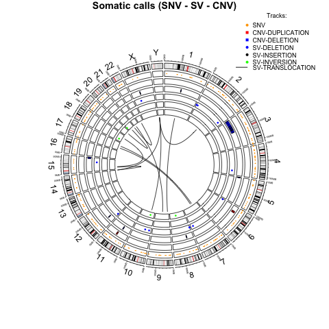

The on-line version is available at here:
https://github.com/mbourgey/EBI_cancer_workshop_visualization/tree/australia_2015

Key Learning Outcomes
---------------------

After completing this practical the trainee should be able to:

-   Generate circos like graphics using R

Resources You’ll be Using
-------------------------

### Tools Used

R:  
https://cran.r-project.org/

R package circlize:  
https://cran.r-project.org/web/packages/circlize/index.html

Introduction
------------

This short workshop will show you how to visualize your data.

We will be working on 3 types of somatic calls:

-   SNV calls from MuTect (vcf)

-   SV calls from DELLY (vcf)

-   CNV calls from SCoNEs (tsv)

This work is licensed under a Creative Commons Attribution-ShareAlike
3.0 Unported License. This means that you are able to copy, share and
modify the work, as long as the result is distributed under the same
license.

Prepare the Environment
-----------------------

We will use a dataset derived from the analysis of whole genome
sequencing paired normal/tumour samples

The call files are contained in the folder visualization:

`mutect.somatic.vcf`\
:   
`delly.somatic.vcf`\
:   
`scones.somatic.tsv`\
:   

Many tools are available to do this the most common know is circos. But
circos is a really not user friendly. In this tutoriel we show you an
easy alternative to build circular representation of genomic data.

First we need to go in the folder to do the analysis

    cd /home/trainee/visualization/

Let see what is in this folder

    ls

circos.R delly.somatic.vcf mutect.somatic.vcf scones.somatic.tsv

Take a look of the data files.

These are data of the are not restricted to a short piece of the
chromosome.

SNVs have already been filtered

    less mutect.somatic.tsv
    less delly.somatic.vcf
    less data/scones.somatic.30k.tsv

`What can you see from this data ?`

I saw:

-   the filtered output of 3 differents software: mutect (SNVs), delly
    (SVs), SCoNEs (CNVs)

-   The 3 files show 2 different formats (vcf, tsv)

-   almost all type of variant are represented here: mutations,
    deletion, inversion, translocation, large amplification and deletion
    (CNVs)

`Why don’t we use the vcf format for all type of call?`

The 1000 Genomes project try to use/include SVs call in the vcf format.
Some tools like Delly use this format for SV. This a good idea to try to
include everything altogether but, to my point of view, this not the
best way to handle SV and CNV.

Why ?

Due to the nature of these calls, you can not easily integrate the
postional information of the two breakpoints (that could be located
faraway or in an other chormosome) using a single position format.

The analysis will be done using the R program

    R

We will use the circlize package from the cran R project. This package
is dedicated to generate circular plot and had the advantage to provide
pre-build function for genomics data. One of the main advantage of this
tools is the use of bed format as input data.

    library(circlize)

Let’s import the variants

    snp=read.table("mutect.somatic.vcf")
    sv=read.table("somatic.sv.vcf")
    cnv=read.table("data/scones.somatic.tsv",header=T)

We need to set-up the generic graphical parameters

    par(mar = c(1, 1, 1, 1))
    circos.par("start.degree" = 90)
    circos.par("track.height" = 0.05)
    circos.par("canvas.xlim" = c(-1.3, 1.3), "canvas.ylim" = c(-1.3, 1.3))

Let’s draw hg19 reference ideograms

    circos.initializeWithIdeogram(species = "hg19")

Unfortunately circlize does not support hg38 yet. So we will need to
reformat our data to fit the hg19 standards As we work only on autosomes
we won’t need to lift-over and we could simply add **chr** at the begin
of the chromosome names

We can now draw 1 track for somatic mutations

    snv_tmp=read.table("data/mutec.somatic.vcf",comment.char="#")
    snv=cbind(paste("chr",as.character(snp[,1]),sep=""),snp[2],snp[,2]+1)
    circos.genomicTrackPlotRegion(snv,stack=TRUE, panel.fun = function(region, value, ...) {
        circos.genomicPoints(region, value, cex = 0.05, pch = 9,col='orange' , ...)
    })

Let’s draw the 2 tracks for cnvs. One track for duplication in red and
one blue track for deletion.

    dup=cnv[cnv[,5]>2,]
    dup[,1]=paste("chr",as.character(dup[,1]),sep="")
    del=cnv[cnv[,5]<2,]
    del[,1]=paste("chr",as.character(del[,1]),sep="")
    circos.genomicTrackPlotRegion(dup, stack = TRUE,panel.fun = function(region, value, ...) {
            circos.genomicRect(region, value, col = "red",bg.border = NA, cex=1 , ...)
    })
    circos.genomicTrackPlotRegion(del, stack = TRUE,panel.fun = function(region, value, ...) {
            circos.genomicRect(region, value, col = "blue",bg.border = NA, cex=1 , ...)
    })

We can cleary see a massive deletion in the chromosome 3.

To finish we just need to draw 3 tracks + positional links to represent
SVs

Unfortunately the vcf format has not been designed for SVs. SVs are
defined by 2 breakpoints and the vcf format store the second one in the
info field. So we will need to extract this information to draw these
calls.

    chrEnd=NULL
    posEnd=NULL
    for (i in 1:dim(sv)[1]) {
        addInfo=strsplit(as.character(sv[i,8]),split=";")
        chrInf=strsplit(addInfo[[1]][3],split="=")
        chrEnd=c(chrEnd,chrInf[[1]][2])
        posInf=strsplit(addInfo[[1]][4],split="=")
        posEnd=c(posEnd,posInf[[1]][2])
    }
    svTable=data.frame(paste("chr",sv[,1],sep=""),as.numeric(sv[,2]),as.numeric(posEnd),paste("chr",chrEnd,sep=""),as.character(sv[,5]))

Now that we reformat the SV calls, let’s draw them

    typeE=c("<DEL>","<INS>","<INV>")
    colE=c("blue","black","green")
    for (i in 1:3) {
            bed_list=svTable[svTable[,5]==typeE[i],]
            circos.genomicTrackPlotRegion(bed_list,stack=TRUE, panel.fun = function(region, value, ...) {
                    circos.genomicPoints(region, value, cex = 0.5, pch = 16, col = colE[i], ...)
            })
    }

    bed1=cbind(svTable[svTable[,5]=="<TRA>",1:2],svTable[svTable[,5]=="<TRA>",2]+5)
    bed2=cbind(svTable[svTable[,5]=="<TRA>",c(4,3)],svTable[svTable[,5]=="<TRA>",3]+5)

    for (i in 1:dim(bed1)[1]) {
        circos.link(bed1[i,1],bed1[i,2],bed2[i,1],bed2[i,2])
    }

A good graph needs title and legends

    title("Somatic calls (SNV - SV - CNV)")
    legend(0.7,1.4,legend=c("SNV", "CNV-DUPLICATION","CNV-DELETION","SV-DELETION","SV-INSERTION","SV-INVERSION"),col=c("orange","red","blue","blue","black","green","red"),pch=c(16,15,15,16,16,16,16,16),cex=0.75,title="Tracks:",bty='n')
    legend(0.6,0.95,legend="SV-TRANSLOCATION",col="black",lty=1,cex=0.75,lwd=1.2,bty='n')

you should obtain a plot like this one:

[h] 

`could you generate the graph and save it into a pdf file ?`

    circos.clear()
    pdf("circos.pdf")
    ...
    dev.off()

Finally exit R

    q("yes")

Acknowledgements
----------------

I would like to thank and acknowledge Louis Letourneau for this help and
for sharing his material. The format of the tutorial has been inspired
from Mar Gonzalez Porta. I also want to acknowledge Joel Fillon, Louis
Letrouneau (again), Francois Lefebvre, Maxime Caron and Guillaume
Bourque for the help in building these pipelines and working with all
the various datasets.
